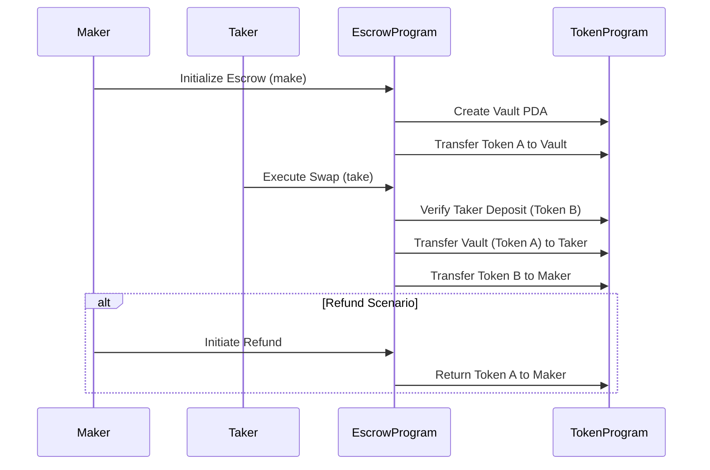

# Solana Escrow Protocol 🔄🔒  

**Secure Token Exchange System with PDA-Managed Vaults**  
*An Anchor-based implementation of cross-chain-like token swaps on Solana*

## Overview 📜

A decentralized escrow system enabling atomic swaps between SPL tokens using program-derived addresses (PDAs) for secure asset custody. Implements maker-taker pattern with automated settlement and refund capabilities.

## Key Features 🛡️

- **Atomic Swap Mechanism**: Trustless token exchanges between two parties
- **PDA Vault System**: Secure custody of escrowed assets
- **Multi-Token Support**: SPL token standard compliance (Fungible & NFT-ready)
- **Automated Settlement**: Pre-encoded business logic for swap execution
- **Safety Guarantees**:
  - Maker refund capability
  - Taker deposit verification
  - Anti-theft protections through PDA ownership

## Technical Architecture 🧠



## Core Components 🔩

### 1. Escrow State Account

```rust
#[account]
#[derive(InitSpace)]
pub struct Escrow {
    pub seed: u64,      // 8
    pub maker: Pubkey,  // 32
    pub mint_a: Pubkey, // 32
    pub mint_b: Pubkey, // 32
    pub receive: u64,   // 8
    pub bump: u8        // 1
}                       // Total: 113 bytes
```

### 2. Instruction Handlers

| Instruction | Parameters | Description |
|-------------|------------|-------------|
| `make`      | seed, receive | Initialize escrow & deposit Token A |
| `take`      | -          | Execute swap by depositing Token B |
| `refund`    | -          | Cancel escrow and reclaim Token A |

### 3. Security Model

```rust
// PDA Validation in Take instruction
#[account(
    mut,
    close = maker,
    has_one = maker,
    has_one = mint_a,
    has_one = mint_b,
    seeds = [b"escrow", maker.key().as_ref(), escrow.seed.to_le_bytes().as_ref()],
    bump = escrow.bump
)]
escrow: Account<'info, Escrow>,
```

## Development Setup ⚙️

### Requirements

- Rust 1.65+
- Solana CLI 1.16.18+
- Anchor 0.29.0

### Installation

```bash
git clone https://github.com/your-org/solana-atomic-swap.git
cd solana-atomic-swap
anchor build
solana-test-validator --reset
anchor deploy
```

## Usage Examples 💼

### 1. Initialize Escrow (Maker)

```typescript
const [escrowPDA] = await PublicKey.findProgramAddressSync(
  [
    Buffer.from("escrow"),
    maker.publicKey.toBuffer(),
    new BN(seed).toArrayLike(Buffer, "le", 8)
  ],
  program.programId
);

await program.methods.make(seed, receiveAmount)
  .accounts({
    maker: maker.publicKey,
    mintA: tokenAMint,
    mintB: tokenBMint,
    escrow: escrowPDA,
    vault: vaultATA,
    systemProgram: SystemProgram.programId,
    tokenProgram: TOKEN_PROGRAM_ID,
  })
  .signers([maker])
  .rpc();
```

### 2. Execute Swap (Taker)

```typescript
await program.methods.take()
  .accounts({
    taker: taker.publicKey,
    maker: makerAddress,
    escrow: escrowPDA,
    vault: vaultATA,
    takerAtaA: takerTokenAATA,
    takerAtaB: takerTokenBATA,
    makerAtaB: makerTokenBATA,
    tokenProgram: TOKEN_PROGRAM_ID,
  })
  .signers([taker])
  .rpc();
```

## Security Model 🔐

1. **PDA Authority Enforcement**

   ```rust
   let signer_seeds = [&[
       b"escrow",
       self.maker.to_account_info().key.as_ref(),
       &self.escrow.seed.to_le_bytes()[..],
       &[self.escrow.bump],
   ]];
   ```

2. **Cross-Program Invocation Safety**
3. **State Validation Guards**:
   - `has_one` constraints for mint consistency
   - Close-on-completion patterns
   - Associated token account verification

## License 📄

Apache 2.0 - See [LICENSE](LICENSE) for full terms
